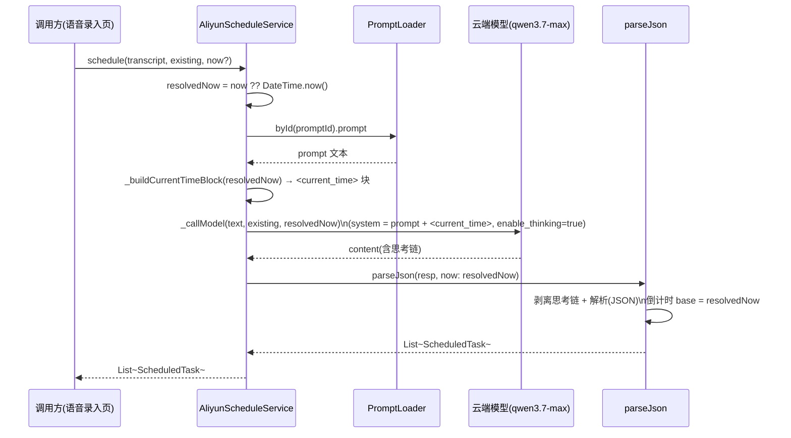
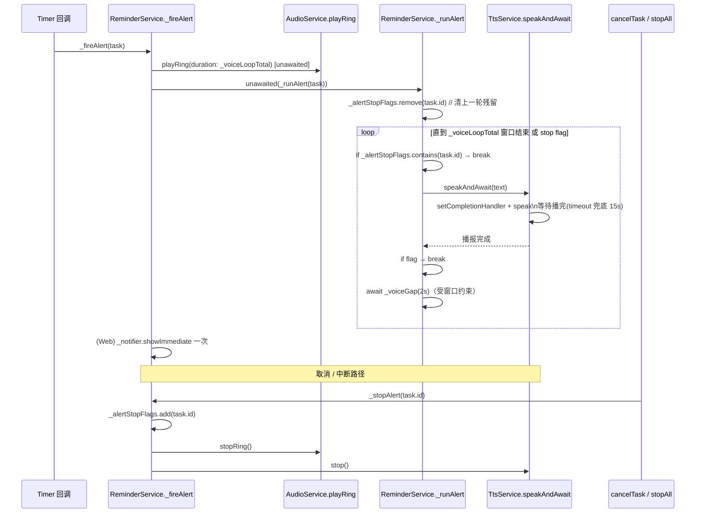
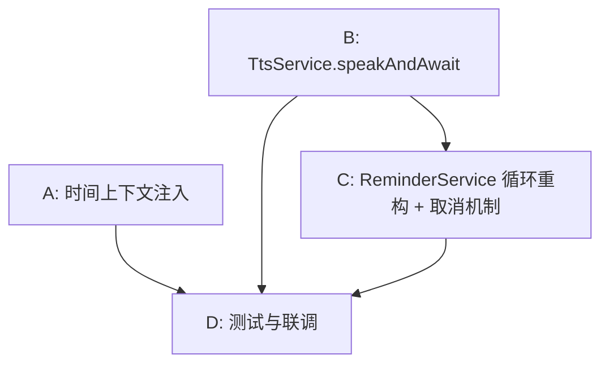

# daily_planner 功能增强 — 系统架构与任务分解

> 设计阶段产出：仅包含架构方案、关键接口签名与有序任务分解，**不含实现代码细节**（由工程师落地）。
> 适用范围：Flutter 3.44.6 项目 `d:\code\project\contemporary-opinion`，两项增强均落在既有服务上。

---

## 1. 实现方案与框架选型

### 1.1 总体判断

两项需求都属于**存量服务的局部增强**，不涉及新增架构层、不引入新第三方依赖：

- **需求一（时间上下文传递）**：在既有 `AliyunScheduleService.schedule()` 链路中透传一个 `DateTime now`，并在拼装 system prompt 时注入一段 `<current_time>` 块；同时把 `now` 传给已支持该参数的 `parseJson(resp, now:)`。倒计时基准与提示词基准统一为同一 `now`。
- **需求二（语音提醒循环播放）**：在 `ReminderService` 内把「响铃 + 语音」从「各一次」重构为「10 秒窗口内循环语音播报、间隔 2 秒」，并新增可中断机制；`TtsService` 新增 `speakAndAwait()` 以支持「等本次播完再进入 2 秒间隔」的语义。

### 1.2 关键技术点

| 难点 | 方案 |
|------|------|
| 相对时间（"明天下午3点""10分钟后"）必须以真实当前时间为基准 | `schedule()` 处生成一次 `now`，透传至 `_callModel`（拼 `<current_time>` 指令）与 `parseJson`（倒计时 `base`），保证双基准一致 |
| 模型为「仅思考模式」（`enable_thinking` 已 `true`），响应含思考链 | 既有 `_extractJsonText` 已剥离思考链，本次**不改动**，沿用即可 |
| 语音需「循环播报 + 间隔 2 秒 + 总时长 10 秒」 | `ReminderService._runAlert` 异步循环：`await tts.speakAndAwait(text)` → 检查 stop flag → `await 2s`；由 `Timer` 同步回调以 `unawaited(_runAlert(task))` 启动 |
| `speakAndAwait` 需等待播完，但 Web / 部分设备无 completion 回调 | 用 `setCompletionHandler` 驱动 `Completer`，并设 `timeout`（默认 15s）兜底防死等；播前 `_tts.stop()` 避免叠加 |
| 取消 / 重复任务需立即中断正在播放的语音与响铃 | 新增 `_alertStopFlags`（Set<String> 任务 id）；`_runAlert` 开头先 `remove` 清残留，`cancelTask`/`stopAll` 调 `_stopAlert(id)` 置 flag + 停响铃 + 停 TTS |

### 1.3 框架与依赖

- 复用既有：`flutter_tts`（TTS）、`flutter_ringtone_player`（`AudioService.playRing` 每 2 秒重播机制已具备）、`flutter_local_notifications` + `timezone`（精确调度）、`http`（模型调用）。
- **本次不新增任何依赖包**。`unawaited` 来自已 import 的 `dart:async`；`Completer`/`TimeoutException` 来自 `dart:async`（TtsService 需补 `import 'dart:async';`）。
- 架构模式：沿用既有「服务层（Service）+ 模型层（Model）+ 提示词资源（assets/prompts）」分层，无新抽象。

---

## 2. 文件列表（相对路径 + 改动类型）

| 文件 | 改动类型 | 说明 |
|------|----------|------|
| `lib/services/aliyun_schedule_service.dart` | 改 | `schedule` 增加 `now` 参数；`_callModel` 增加 `now` 形参并拼 `<current_time>`；新增 `_buildCurrentTimeBlock(now)`；`parseJson` 调用透传 `now` |
| `assets/prompts/tasks_voice_scheduled.yaml` | 改 | 新增 `<current_time>` 约束段（提示模型以注入的当前时间为基准） |
| `assets/prompts/tasks_voice_delay.yaml` | 改 | 同上，新增 `<current_time>` 约束段 |
| `lib/services/tts_service.dart` | 改 | 新增 `speakAndAwait(text, {timeout})`；补 `import 'dart:async';` |
| `lib/services/reminder_service.dart` | 改 | 新增常量 `_voiceLoopTotal`/`_voiceGap`；新增 `_alertStopFlags`/`_runAlert`/`_stopAlert`；`_fireAlert` 改为并发启动响铃 + 语音循环；`cancelTask`/`stopAll` 接入 `_stopAlert` |
| `test/unit/aliyun_schedule_service_test.dart` | 增 | 验证 `now` 透传与 `<current_time>` 注入、倒计时 base 一致 |
| `test/unit/tts_service_test.dart` | 增 | 验证 `speakAndAwait` 等待完成与 timeout 兜底 |
| `test/unit/reminder_service_test.dart` | 增 | 验证 10 秒循环窗口、2 秒间隔、stop flag 中断 |

---

## 3. 数据结构和接口（关键签名变更）

### 3.1 类图（Mermaid）

```mermaid
classDiagram
    class AliyunScheduleService {
        +Future~List~ScheduledTask~~ schedule(transcript, {List~Task~ existing, DateTime? now})
        -Future~String~ _callModel(transcript, existing, DateTime now)
        -String _buildCurrentTimeBlock(DateTime now)
        +static List~ScheduledTask~ parseJson(jsonString, {DateTime? now})
    }
    class ScheduledTask {
        <<既有，未改>>
        +String title
        +DateTime? scheduledTime
        +int? ringSeconds
        +int? countdownSeconds
    }
    class ReminderService {
        +static const Duration _voiceLoopTotal
        +static const Duration _voiceGap
        -Set~String~ _alertStopFlags
        -void _fireAlert(Task task)
        -Future~void~ _runAlert(Task task)
        -void _stopAlert(String id)
        +Future~void~ cancelTask(Task task)
        +Future~void~ stopAll()
    }
    class TtsService {
        +Future~void~ speak(String text)
        +Future~void~ speakAndAwait(String text, {Duration? timeout})
        +Future~void~ stop()
    }
    class AudioService {
        +Future~void~ playRing({Duration duration})
        +Future~void~ stopRing()
    }
    ReminderService --> TtsService : 调用 speakAndAwait / stop
    ReminderService --> AudioService : 调用 playRing / stopRing
    AliyunScheduleService ..> ScheduledTask : 解析产出
```

### 3.2 关键方法签名

**`AliyunScheduleService`（需求一）**

```dart
// ① schedule：新增可选 now，默认 null（内部 now ??= DateTime.now()）
Future<List<ScheduledTask>> schedule(
  String transcript, {
  List<Task> existing = const [],
  DateTime? now,                 // ★ 新增
});

// ② _callModel：新增 DateTime now 形参（必填，由 schedule 传入）
Future<String> _callModel(String transcript, List<Task> existing, DateTime now);

// ③ 新增：拼装 <current_time> 指令块（ISO + 中文星期 + 基准指令）
String _buildCurrentTimeBlock(DateTime now);

// ④ parseJson：已存在 now 参数，本次在 schedule 内显式传入
static List<ScheduledTask> parseJson(String jsonString, {DateTime? now});
```

**`TtsService`（需求二）**

```dart
// 新增：等待本次播报完成（timeout 兜底），播前 stop 防叠加
Future<void> speakAndAwait(String text, {Duration? timeout});
// 既有：
Future<void> speak(String text);   // fire-and-forget，保留
Future<void> stop();
```

**`ReminderService`（需求二）**

```dart
// 新增常量（集中定义，便于统一调参）
static const Duration _voiceLoopTotal = Duration(seconds: 10);
static const Duration _voiceGap      = Duration(seconds: 2);

// 新增：正在播放告警的任务 id 集合（取消/中断标志）
final Set<String> _alertStopFlags = {};

// 变更：并发启动「响铃(10s窗口)」+「语音循环」，Web 保留一次浏览器通知
void _fireAlert(Task task);

// 新增：异步语音循环（10s 窗口 / 2s 间隔 / stop flag 中断）
Future<void> _runAlert(Task task);

// 新增：置 stop flag + 停响铃 + 停 TTS，立即中断
void _stopAlert(String id);

// 变更：取消通知 + Timer 后，新增 _stopAlert(id)
Future<void> cancelTask(Task task);

// 变更：清空 Timer 后，新增对所有在播告警的 _stopAlert
Future<void> stopAll();
```

---

## 4. 程序调用流程（Mermaid 时序图）

### 4.1 语音排期注入 `now`



### 4.2 到点语音循环播放（+ 取消/中断）



---

## 5. 任务列表（有序 + 依赖关系）

> 按实现顺序排列；A 与 B 可并行起步，C 依赖 B，D 依赖 A/B/C。
> 分组遵循「按功能模块」原则：B/C 为内聚的单服务改动，各自配套单测文件（受既有项目结构约束，未强行拆分到多文件）。

| Task | 名称 | 源文件（改动类型） | 依赖 | 优先级 |
|------|------|-------------------|------|--------|
| **A** | 时间上下文注入 | `lib/services/aliyun_schedule_service.dart`(改)、`assets/prompts/tasks_voice_scheduled.yaml`(改)、`assets/prompts/tasks_voice_delay.yaml`(改) | 无 | P0 |
| **B** | TtsService.speakAndAwait | `lib/services/tts_service.dart`(改)、`test/unit/tts_service_test.dart`(增) | 无 | P1 |
| **C** | ReminderService 循环重构 + 取消机制 | `lib/services/reminder_service.dart`(改)、`test/unit/reminder_service_test.dart`(增) | B | P0 |
| **D** | 测试与联调 | `test/unit/aliyun_schedule_service_test.dart`(增)、`test/unit/tts_service_test.dart`(增)、`test/unit/reminder_service_test.dart`(增) | A, B, C | P1 |

### 各任务落地要点

- **A — 时间上下文注入**
  - `schedule(transcript, existing, now?)`：`now` 默认 `null` → 内部 `resolvedNow = now ?? DateTime.now()`，全程只生成一次。
  - `_callModel` 增加 `DateTime now` 形参；`system = prompt + '\n' + _buildCurrentTimeBlock(now)`。
  - `_buildCurrentTimeBlock(now)`：输出 ISO 8601 时间戳 + 中文星期（周一…周日）+ 明确指令「所有相对时间必须以该当前时间为基准推算绝对日期时间，不得假设其他时间」。
  - `parseJson(resp, now: resolvedNow)`：保证倒计时 `base` 与提示词基准一致。
  - 两个 YAML 各新增一段 `<current_time>` 约束（提示模型以注入时间为基准；延时提示词同时强调相对时长也基于此推算）。
  - 本地兜底 `_fallback`（NlpParser，内部 `DateTime.now()`）本次**不强制改**（行为正确）。

- **B — TtsService.speakAndAwait**
  - 新增 `Future<void> speakAndAwait(String text, {Duration? timeout})`：播前 `_tts.stop()`；用 `setCompletionHandler` 驱动 `Completer`；`await completer.future.timeout(timeout ?? 15s)`（超时兜底，finally 中复位 handler）；`text` 为空直接返回。
  - 补 `import 'dart:async';`。
  - 既有 `speak` / `stop` 保留不变。

- **C — ReminderService 循环重构 + 取消机制**
  - 常量：`_voiceLoopTotal = 10s`、`_voiceGap = 2s`（响铃窗口与之相同）。
  - `_fireAlert`：`unawaited(audio.playRing(duration: _voiceLoopTotal))` + `unawaited(_runAlert(task))` 并发；Web 端保留一次 `_notifier.showImmediate`。
  - `_runAlert(task)`：`_alertStopFlags.remove(task.id)` 开头清残留；`while (now - start < _voiceLoopTotal)`：`if (contains id) break` → `await speakAndAwait(text)` → `if (contains id) break` → 受窗口约束地 `await _voiceGap`；异常静默忽略。
  - `_stopAlert(id)`：置 flag + `unawaited(audio.stopRing())` + `unawaited(tts.stop())`。
  - `cancelTask` / `stopAll` 接入 `_stopAlert`（stopAll 对所有在播 id 调 `_stopAlert` 后清空 flag 并停响铃/TTS）。

- **D — 测试与联调**
  - A：`now` 固定值下校验 `<current_time>` 注入与倒计时 `base` 一致；相对时间推算正确。
  - B：`speakAndAwait` 在 mock TTS 下验证「等待完成」与「超时兜底不抛异常」。
  - C：用 fake clock / mock 验证 10 秒窗口循环次数与 2 秒间隔、stop flag 立即中断、`_fireAlert` 并发启动。

### 任务依赖图



---

## 6. 依赖包列表

**本次无新增依赖包。** 全部复用既有：

```
- flutter_tts            : 语音播报（新增 speakAndAwait，复用 FlutterTts.setCompletionHandler）
- flutter_ringtone_player: 系统闹钟响铃（playRing 内部每 2 秒重播机制已具备，直接复用）
- flutter_local_notifications: 精确调度与通知（既有）
- timezone               : 时区调度（既有）
- http                   : 云端模型调用（既有）
- flutter (SDK)          : dart:async（unawaited / Completer / TimeoutException）已随 SDK 提供
```

---

## 7. 共享知识（跨切面约定，供工程师落地一致）

- **`now` 的单一来源**：仅在 `schedule()` 处生成一次（`now ?? DateTime.now()`），随后透传至 `_callModel`（提示词基准）与 `parseJson`（倒计时 `base`）。调用方（语音录入页）一般不传 `now`，由服务内部决定；任何新增排期入口都必须沿用同一透传路径，禁止在别处重新 `DateTime.now()`。
- **10 秒 / 2 秒常量集中定义**：`_voiceLoopTotal`（10s）、`_voiceGap`（2s）作为 `ReminderService` 的 `static const` 集中定义；响铃窗口与语音循环窗口**必须同源**（均为 `_voiceLoopTotal`），避免两者时长不一致导致语音停了响铃还在或反之。
- **Completion handler 并发安全性**：`speakAndAwait` 为**顺序调用**（循环内一次只 `await` 一个），同一时刻仅一条播报进行，无竞态；每次进入方法时重新 `setCompletionHandler` 并在 finally 复位，避免跨调用串台。
- **倒计时 base 一致性**：`parseJson(now)` 的 `base` 与 system prompt 的 `<current_time>` 必须是同一个 `now`，否则「模型输出相对秒数」与「实际触发时刻」会错位。
- **思考链剥离不变**：`enable_thinking` 已 `true` 且 `_extractJsonText` 已剥离思考链，本次**不改动**该路径。
- **取消/中断语义**：`_alertStopFlags` 以任务 `id` 为键；`_runAlert` 开头 `remove` 是为了清除上一轮（重复任务）残留 flag，避免误杀本轮；`cancelTask`/`stopAll` 通过 `_stopAlert` 置 flag + 停响铃 + 停 TTS 实现「立即中断」。
- **Web 端**：保留 `kIsWeb` 下的一次性浏览器通知即时提醒；语音循环依赖 `flutter_tts` 的 Web 支持，不可用时按既有逻辑静默忽略。

---

## 8. 待明确事项（需用户/产品拍板）

1. **语音循环总时长是否应被 `task.ringSeconds` 覆盖？**
   本次按需求**固定 10 秒**（响铃窗口与语音窗口一致）。但既有逻辑中 `secs = task.ringSeconds ?? settings?.ringSecondsDefault ?? 5` 支持每任务自定义响铃时长。若希望「响铃/语音时长」仍以用户/任务设定为准（而非硬编码 10s），需确认是否改为 `_voiceLoopTotal = Duration(seconds: task.ringSeconds ?? settings?.ringSecondsDefault ?? 10)`。**建议先按需求固定 10 秒实现，后续再决定是否参数化。**

2. **重复任务「相邻触发间隔 < 10 秒」的极端场景**：本应用最小时间单位为分钟级，基本不会触发；但若出现上一轮语音仍在窗口内、下一轮又触发，`_runAlert` 开头 `remove(id)` 已避免误杀本轮。是否需要支持「新一轮强制打断上一轮」？目前设计是两轮并存（各跑各自 10 秒窗口）。请确认预期。

3. **Web 端语音循环是否必须生效**：本次仅在原生端保证语音循环；Web 端若 `flutter_tts` 不支持则静默忽略，仅保留浏览器通知。请确认 Web 端是否要求语音循环也生效（如需，可能要额外 Web TTS 适配，超出本次范围）。

4. **`now` 透传范围是否扩展到记事本语音解析**：`parseWithPrompt`（记事本）本次**不注入** `<current_time>`（其无相对时间排期需求）。若后续记事本也需要相对时间基准，可复用同一 `_buildCurrentTimeBlock` 扩展，需另行评估。

5. **`<current_time>` 时区呈现**：建议注入**设备本地时间**的 ISO（`toLocal()`）+ 中文星期，与用户口语语境一致；若云端要求 UTC，再改用 `toUtc()`。请确认以本地还是 UTC 呈现（默认建议本地）。
