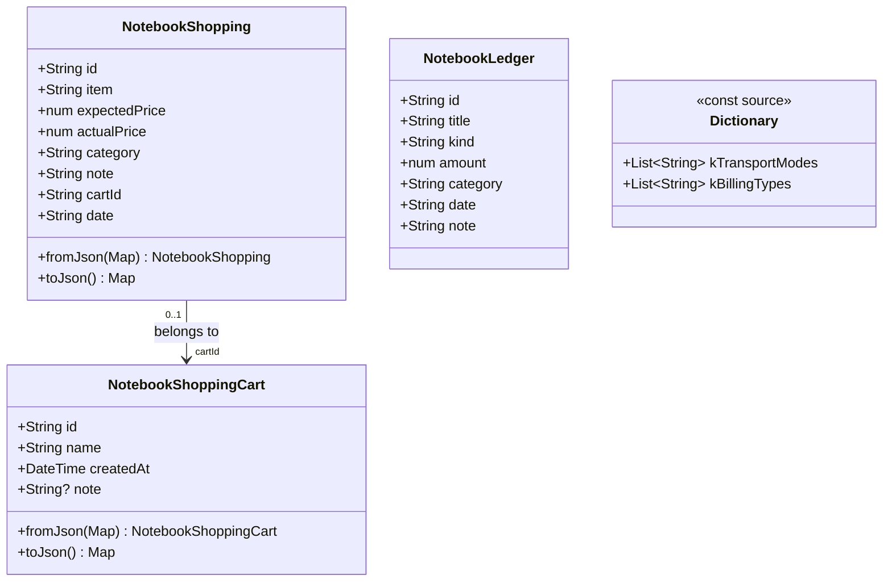
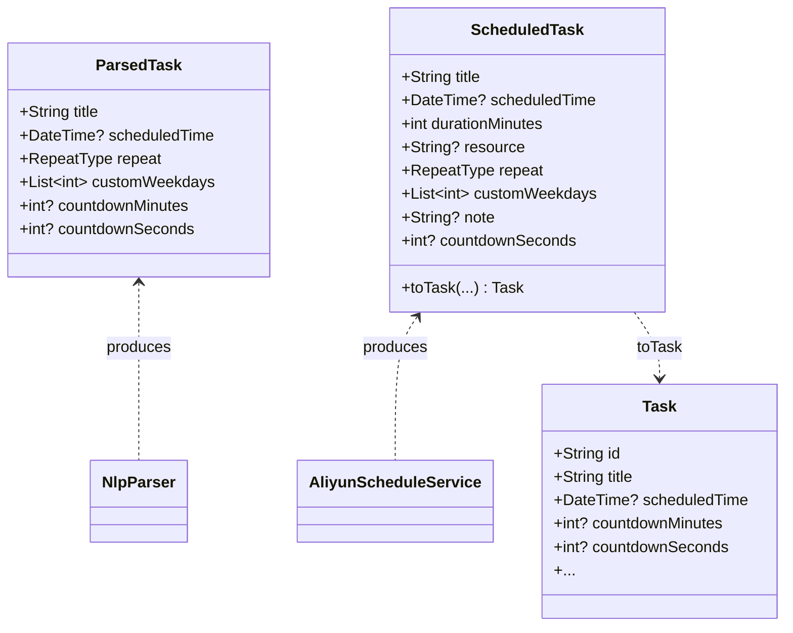
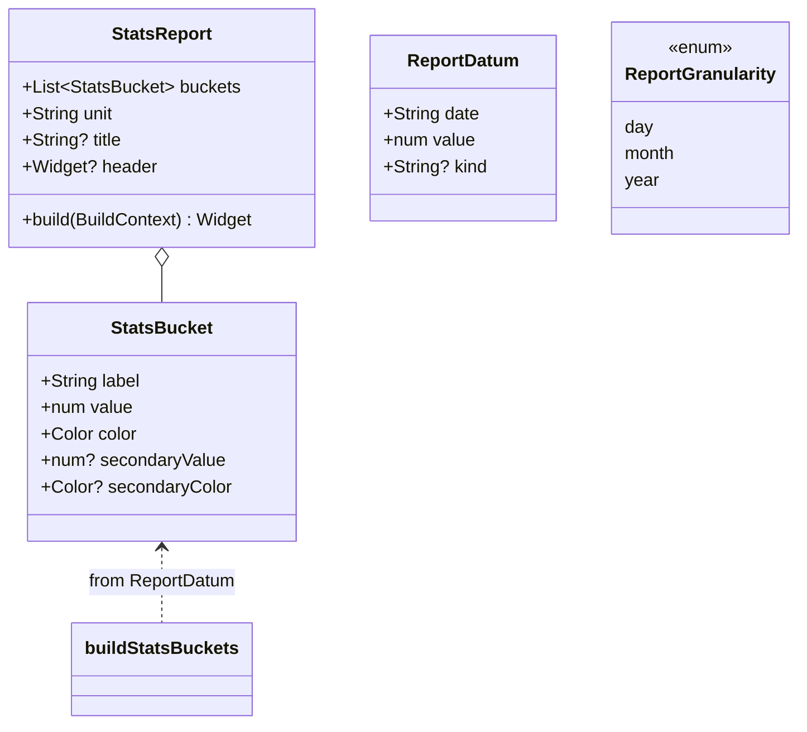

# 增量架构设计 + 任务分解：每日规划助手 v1.1

> 文档版本：v1.0 · 日期：2026-07-19 · 架构师：高见远
> 配套：本文为 `docs/incremental-prd-2026-07-19.md`（许清楚）的增量设计落地文档
> 图件：`docs/class-diagram-incremental.mermaid`、`docs/sequence-diagram-incremental.mermaid`
> 语言：简体中文 · 范围：**仅描述增量变更**，不重写既有模块

---

## 1. 实现方案 + 框架选型

### 1.1 总体策略
全部沿用既有技术栈，本增量**无任何新依赖**（见 §6 依赖包列表，预期为 0 新增）。

| 维度 | 沿用方案 | 本增量处理方式 |
|------|----------|----------------|
| 持久化 | Hive（JSON-map 存储，`NotebookStore` 继承 `ChangeNotifier`） | 新增 `notebook_shopping_carts` 盒子（JSON-map，与既有一致）；`Task` 仅新增一个 `HiveField(16)` |
| 状态 | Provider（`Consumer<NotebookStore>`） | 报表/子购物车 UI 复用既有 `Consumer` 模式 |
| 设计语言 | `AppTheme`（青绿 `0xFF0F8C7E`、语义色、`radiusLg/Md/Sm`） | 柱状图、徽标、ChoiceChip 全部复用 `AppTheme` 语义色与圆角 |
| 语音解析 | 云端 `AliyunScheduleService` + 本地 `NlpParser` 回退 | **双路径增强**（见 §1.2），行为保持一致 |
| 图表 | pubspec **无图表库** | **自绘柱状图**（6 个 `Container` 高度映射 + `AppTheme` 语义色/圆角），抽成共享组件 |

### 1.2 G1 任务双路径（⚠️ 核心改动区，需明确回归边界）
**设计裁决（依据总监齐活林对 Q1/Q3 的拍板）：**
- 云端 prompt + 本地 `NlpParser` **双覆盖**；云端失败时本地兜底，保证可用。
- 秒级倒计时按绝对时间调度：`scheduledTime = now + Duration(seconds: countdownSeconds)`，平台 ≥10s 可行（`flutter_local_notifications` 的 `zonedSchedule` 无最小间隔限制，且 PRD Q3 已确认）。
- **回退链路必须透传倒计时**：`ScheduledTask.countdownSeconds` 在 `_fallback` 与 `parseJson` 两处均填充。

**⚠️ 关键结论（避免回归）**：提醒调度层 `ReminderService._scheduleTask` / `NotificationService.schedule` **完全不用改**。当前 `_scheduleTask` 对 `RepeatType.none` 走 `matchDateTimeComponents: null` 的单次 `zonedSchedule` + 应用内 `Timer`，`scheduledTime` 已是绝对时间，10 秒倒计时天然可调度。G1 的所有改动被严格限制在：`nlp_parser.dart`、`aliyun_schedule_service.dart`、`task.dart` 三处，不触碰调度/通知/冲突检测。

**双路径改动点清单（G1）：**
- **本地路径 `nlp_parser.dart`**：
  - 相对时间正则新增「秒」单位，兼容「X秒后」「提醒时间(为)X秒」两种口语（P0-1.1）。
  - `_cleanTitle` 之后新增**核心目的抽取** `_extractCorePurpose`：剥离时间表达式、提醒/倒计时短语、重复词，取剩余动作片段；为空则回退原 `_cleanTitle`（P0-1.4）。
  - `ParsedTask` 新增 `int? countdownSeconds`（保留 `countdownMinutes` 兼容）。
- **云端路径 `aliyun_schedule_service.dart`**：
  - `_callModel` 的 system prompt 增加：① 要求输出 `remind_in_seconds`（相对 now 的整数秒或 `remind_in_minutes`）；② `title` 必须为**核心目的/动作**，禁止含时间/提醒/重复参数（P0-1.2 / P0-1.5）。
  - `parseJson` 读取 `remind_in_seconds` 计算 `scheduledTime = now + 秒`，并填充 `countdownSeconds`（P0-1.2 / P0-1.3）。
  - `_fallback` 透传 `ParsedTask.countdownSeconds` 到 `ScheduledTask`（P0-1.3）。
- **模型 `task.dart`**：
  - `Task` 新增 `int? countdownSeconds`（`HiveField(16)`），`TaskAdapter.read/write` 同步（老数据读回 `null` 安全）。
  - `ScheduledTask` 新增 `int? countdownSeconds`，`toTask` 透传；`ParsedTask` 新增 `int? countdownSeconds`。

### 1.3 G2 购物车子功能（最小增量）
- **数据模型**：新增 `NotebookShoppingCart`（id/name/createdAt/note?）；`NotebookShopping` 增加 `String cartId`（默认 `''` = 未分组）+ `String date`（默认 `''`，用于日/月/年报表，详见 §8 风险 R1）。
- **容器策略**：采用总监拍板的「外键 `cartId` + 独立 `notebook_shopping_carts` 盒子」最小增量。旧数据 `cartId==''` 在读取/统计时归入名为「未分组」的**合成默认分组**，**不写迁移脚本**破坏旧库（P0-2.2）。
- **统计/报表**：子购物车独立统计（项数、ΣexpectedPrice、ΣactualPrice、差额）；整体报表抽为共享组件 `StatsReport`（见 §3 / §4）。

### 1.4 G3 账本报表（复用 G2）
- 复用 `StatsReport`；账本按 `kind` 分色（收入 `ok` / 支出 `danger`）。
- `date` 在手动与语音录入默认录入当日（P1-3.2）；空 `date` 在聚合时视为今日。

### 1.5 G4 公共字典（单一来源）
- 新建 `lib/models/dictionary.dart` 导出 `kTransportModes`/`kBillingTypes`（取值与顺序不变）。
- `notebook_trip.dart` 改为 `export 'dictionary.dart' show kTransportModes, kBillingTypes;`（删除文件内硬编码 const），使 `trip_detail.dart` / `notebook_voice_service.dart` / `notebook_trip_test.dart` **零改动**。
- 账本手动表单「分类」改从 `kBillingTypes` 单选（`ChoiceChip`，含「其他」）。

### 1.6 柱状图自绘方案（Q4 拍板：无新依赖）
- 抽离共享组件 `lib/modules/notebook/widgets/notebook_report.dart`：导出 `_StatsReport`（对外 `StatsReport`）+ 纯函数 `buildStatsBuckets(...)`（6 区间切片算法）。
- 柱图**恒 6 区间**（最近 6 日 / 月 / 年），可前后切换起始月/年。
- 每根柱用 `Container`（高度 = `value / max * maxH`，`maxH≈160`，`borderRadius: radiusSm`，语义色填充）；顶部数值、底部轴标签；空态复用 `NotebookEmptyState`。
- 购物：单序列（主色 `accent`）。账本：双序列堆叠（收入 `ok` / 支出 `danger`）。

---

## 2. 文件列表及相对路径

> 标注：【新增】新建文件 · 【改】增量修改既有文件 · （行号区间仅作定位参考）

### 数据模型层
- 【新增】`lib/models/dictionary.dart` — 公共字典单一来源（`kTransportModes`/`kBillingTypes`）。
- 【改】`lib/models/notebook_shopping.dart` — 新增 `NotebookShoppingCart` 类；`NotebookShopping` 增加 `cartId`(默认`''`)、`date`(默认`''`)，同步 `fromJson/toJson`；导出 `kDefaultCartId=''`、`kDefaultCartName='未分组'`。
- 【改】`lib/models/task.dart` — `Task` 增加 `countdownSeconds`(`HiveField(16)`)，`TaskAdapter.read/write` 同步；`ScheduledTask` 增加 `countdownSeconds` 且 `toTask` 透传。
- （注）`lib/models/notebook_trip.dart` 顶部 const 删除，改为 re-export（见 §5 G4）。

### 服务/解析层
- 【改】`lib/services/nlp_parser.dart` — 秒级相对时间匹配（P0-1.1）；`_cleanTitle` 核心目的抽取（P0-1.4）；`ParsedTask` 增加 `countdownSeconds`。
- 【改】`lib/services/aliyun_schedule_service.dart` — `_callModel` prompt 增强（P0-1.2/1.5）；`parseJson` 读取 `remind_in_seconds` 并填 `countdownSeconds`（P0-1.3）；`_fallback` 透传 `countdownSeconds`（P0-1.3）。
- 【改】`lib/services/notebook_store.dart` — `init()` 注册 `notebook_shopping_carts` 盒子；新增 `shoppingCarts` getter 与 `addCart/updateCart/deleteCart`；新增 `cartsOf(cartId)` 分组查询。

### UI 层
- 【新增】`lib/modules/notebook/widgets/notebook_report.dart` — 共享报表组件 `StatsReport` + `buildStatsBuckets(...)` 切片算法 + `StatsBucket`/`ReportDatum`/`ReportGranularity`。
- 【改】`lib/modules/notebook/screens/shopping_detail.dart` — 子购物车卡片列表/筛选（P0-2.3）；报表入口 + 报表页接入 `StatsReport`（P0-2.4）；子购物车创建/编辑/删除弹层（P1-2.5）。
- 【改】`lib/modules/notebook/screens/ledger_detail.dart` — 接入 `StatsReport`（P0-3.1）；`date` 默认录入日（P1-3.2）；「分类」改为 `kBillingTypes` 单选 `ChoiceChip`（P0-4.2）。
- 【改】`lib/modules/tasks/voice_input_screen.dart` — `_PreviewTile` 增加倒计时徽标（P1-1.6）。
- 【改】`lib/models/notebook_trip.dart` — 删除硬编码 const，改为 re-export `dictionary.dart`；`trip_detail.dart` 无需改动。

### 提示词（P1 可选，非阻塞）
- 【改】`assets/prompts/notebook_voice_ledger.yaml` — `category` 规则引用 `kBillingTypes`（P1-4.3）。
- 【改】`assets/prompts/notebook_voice_trip.yaml` — `<dictionaries>` 段同步（P1-4.3）。

---

## 3. 数据模型与接口（类图）

完整 mermaid 见 `docs/class-diagram-incremental.mermaid`。要点如下。

### 3.1 新增/变更模型


- `NotebookShoppingCart`：纯 JSON-map 模型（与 `NotebookShopping` 同风格，无 Hive 适配器）。
- `NotebookShopping.cartId`：默认 `''`，`''` 即「未分组」默认车（常量 `kDefaultCartId=''`）。
- `NotebookShopping.date`：默认 `''`，空时聚合按录入日（今日）处理（见 §8 R1）。
- `Dictionary`：仅两个 `const List<String>`，取值顺序与 `notebook_trip.dart` 现状**完全一致**（飞机/高铁/火车/汽车/地铁/公交/打车/其他；门票/餐饮/购物/交通/其他）。

### 3.2 任务模型（G1 双路径字段）


- `Task.countdownSeconds`：`@HiveField(16)`。`TaskAdapter.read` 用 `fields[16] as int?`（缺失→null，老数据安全）；`write` 将 `writeByte(16)` 改为 `writeByte(17)` 并追加 `writeByte(16)..write(obj.countdownSeconds)`。
- `ScheduledTask.countdownSeconds`：在 `_fallback`（来自 `ParsedTask.countdownSeconds`）与 `parseJson`（来自 `remind_in_seconds`）两处填充；`toTask` 透传给 `Task`。
- `ParsedTask.countdownSeconds`：`_parseClause` 命中秒级正则时赋值；分钟级仍走 `countdownMinutes`（兼容）。

### 3.3 共享报表组件接口（G2/G3）


- `ReportDatum`：报表输入原子（购物：`date`+`value(actualPrice)`+`kind=null`；账本：`date`+`amount`+`kind='income'|'expense'`）。
- `buildStatsBuckets(List<ReportDatum>, ReportGranularity, DateTime anchor)`：纯函数，输出**恒 6 个** `StatsBucket`（见 §7 算法）。
- `StatsBucket.secondaryValue/secondaryColor`：账本收入/支出双序列堆叠；购物仅用 `value/color`。

---

## 4. 程序调用流程（时序图）

完整 mermaid 见 `docs/sequence-diagram-incremental.mermaid`，含 3 个场景。摘要：

### 4.1 场景①：语音"设置提醒时间为10秒"双路径解析 → 提醒调度（G1）
```
用户语音 → VoiceInputScreen._buildSchedule
  → AliyunScheduleService.schedule(transcript)
      分支A（云端可用）：_callModel(增强prompt: remind_in_seconds + 核心目的title)
                         → parseJson(resp, now)  // 计算 scheduledTime=now+秒, 填 countdownSeconds
      分支B（异常/空）：_fallback → NlpParser.parse (本地增强: 秒级正则 + _extractCorePurpose)
                         → 每个 ParsedTask 带 countdownSeconds + 精炼 title
      → List<ScheduledTask>（均含 countdownSeconds, scheduledTime=now+10s）
  → st.toTask(...) → Task(countdownSeconds=10, scheduledTime=now+10s)
  → ConflictDetector.detect/applyDecision
  → TaskStore.addWithConflictCheck(task)
  → ReminderService.notifyTaskChanged(task)  // 不改：RepeatType.none→单次 zonedSchedule + Timer
  → 10 秒后系统通知 + 应用内响铃/播报
```
**双路径一致性保证**：本地 `NlpParser` 与云端 `parseJson` 对「秒提取」和「标题精炼」行为对齐；回归点：输入「30分钟后吃药」仍 `now+30min`、「明天上午9点开会」绝对时间正确（见任务验收）。

### 4.2 场景②：购物子购物车创建 / 统计（G2）
```
ShoppingDetail
  → NotebookStore.shoppingCarts  // 读取 carts 盒子
  → NotebookStore.shopping       // 读取 items，按 cartId 分组（''→未分组）
  → 用户点击「新建子购物车」→ addCart(NotebookShoppingCart) → 写 carts 盒子
  → 用户在某购物车内录入购物项 → addShopping(item with cartId)
  → 统计：cartsOf(cartId) → ΣexpectedPrice / ΣactualPrice / 差额
  → 报表入口 → StatsReport(buildStatsBuckets(shopping→ReportDatum, 粒度, anchor))
```

### 4.3 场景③：账本报表 / 购物报表复用 StatsReport（G3 + 共享）
```
LedgerDetail._showReport
  → NotebookStore.ledger → 每条转 ReportDatum(date, amount, kind)
  → buildStatsBuckets(data, granularity, anchor)  // 恒 6 桶
  → StatsReport(buckets, unit:'¥', 收入 ok/支出 danger 分色)
ShoppingDetail._showReport
  → NotebookStore.shopping → ReportDatum(date, actualPrice, null)
  → buildStatsBuckets(...) → StatsReport(buckets, unit:'¥', 单色 accent)
两处共用同一 StatsReport 组件与同一切片算法（无重复实现）。
```

---

## 5. 任务列表（有序 · 按依赖 · 文件+函数级）

> 分组 G1~G4；每个任务标注【涉及文件】【关键函数/改动点】【依赖】【验收点】。
> 依赖关系：G1/T1 → T2、T3；T2/T3 → T4。G2/T5 → T6、T7；T7 → T6 报表接入。G3/T8 依赖 T7。G4/T9 → T10。
> **注意**：`ledger_detail.dart` 同时被 G3(T8) 与 G4(T10) 修改——建议这两步在同一工作批次内顺序完成，避免互相覆盖。

### G1 任务下达修复与优化（双路径）
- **T1 · 任务模型字段（countdownSeconds）**【P0】
  - 涉及：`lib/models/task.dart`
  - 改动：`Task` 增加 `int? countdownSeconds`（`@HiveField(16)`，`Task(...)` 构造加 `this.countdownSeconds`，`fromJson` 不需要因为手写适配器）；`TaskAdapter.read` 增加 `countdownSeconds: fields[16] as int?`；`TaskAdapter.write` 将 `writeByte(16)`→`writeByte(17)`，末尾追加 `..writeByte(16)..write(obj.countdownSeconds)`；`ScheduledTask` 增加 `int? countdownSeconds` 字段与构造参数，`toTask(...)` 透传 `countdownSeconds: countdownSeconds`；`ParsedTask` 增加 `int? countdownSeconds`（构造加参，保持 `countdownMinutes`）。
  - 依赖：无。
  - 验收：① 升级后旧 `Task` 数据（无字段 16）读回 `countdownSeconds==null` 不崩溃；② 新建 `Task(countdownSeconds:10)` 经适配器 round-trip 后值一致；③ `ScheduledTask(countdownSeconds:10).toTask(...).countdownSeconds==10`。

- **T2 · 本地 NlpParser 双增强（秒级 + 标题精炼）**【P0】
  - 涉及：`lib/services/nlp_parser.dart`
  - 改动：
    - `_parseClause` 在「相对时间」步骤后新增**秒级匹配**：正则兼容 `X秒后` 与 `提醒时间(为)?X秒/分/时`（用 `_parseSeconds(text)` 辅助，命中则 `countdownSeconds = 秒数` 并 `text.replaceFirst(...)`）；`scheduledTime` 计算增加分支 `else if (countdownSeconds != null) scheduled = now.add(Duration(seconds: countdownSeconds))`。
    - `ParsedTask(...)` 构造传递 `countdownSeconds: countdownSeconds`。
    - 新增 `_extractCorePurpose(String)`：在现有 `_cleanTitle` 之后，进一步剥离时间表达式（X秒/X分钟/X点/明天/后天…）、提醒/倒计时短语（提醒时间/提醒/倒计时/定提醒）、重复词（每天/每周…），取剩余动作片段；若结果为空则回退原 `_cleanTitle` 结果。
    - `title = _cleanTitle(text)` 改为 `title = _extractCorePurpose(text)`（内部已含回退）。
  - 依赖：T1（字段存在）。
  - 验收：①「设置提醒时间为10秒，去倒垃圾」→ `countdownSeconds=10`、`scheduledTime≈now+10s`、标题不含「10秒」；② 回归：「30分钟后吃药」仍 `now+30min`，「明天上午9点开会」绝对时间正确；③「设置提醒时间为10秒，去健身房练腿」→ `title='去健身房练腿'`；④ 提供 ≥5 条 fixture 单测（`test/nlp_parser_test.dart` 增量）。

- **T3 · 云端 AliyunScheduleService 双增强（prompt + parseJson + fallback 透传）**【P0】
  - 涉及：`lib/services/aliyun_schedule_service.dart`
  - 改动：
    - `_callModel` 的 `system` prompt：增加要求模型输出 `remind_in_seconds`（相对 now 的整数秒，或 `remind_in_minutes`）；明确要求 `title` 为**核心目的/动作**，禁止含触发时间/提醒时长/重复参数（含示例「设置提醒时间为10秒，去健身房练腿」→「去健身房练腿」）。
    - `parseJson` 签名增加可选 `DateTime? now`（默认 `DateTime.now()`）；读取 `m['remind_in_seconds']`（或折算 `remind_in_minutes*60`）→ 计算 `scheduledTime = now + Duration(seconds: 秒)` 并填 `countdownSeconds`；其余字段解析不变。
    - `_fallback`：`ScheduledTask(...)` 构造增加 `countdownSeconds: p.countdownSeconds`。
  - 依赖：T1。
  - 验收：① 云端可用态下「设置提醒时间为10秒，去倒垃圾」→ `countdownSeconds=10`、`scheduledTime≈now+10s`、`title='去倒垃圾'`，与本地路径行为一致；② 云端失败回退时 10 秒倒计时不丢失（`_fallback` 透传）；③ `parseJson` 对缺 `remind_in_seconds` 的既有 JSON 仍安全返回。

- **T4 · 语音预览倒计时徽标**【P1】
  - 涉及：`lib/modules/tasks/voice_input_screen.dart`（`_PreviewTile`）
  - 改动：在 `subtitle` 行内，当 `task.countdownSeconds != null` 时，复用 `NotebookChip`（或 `Container`+`AppTheme.warn`）显示「X秒后 / 倒计时」徽标，与既有绝对时间文案（`timeText`）并存；不影响其它状态渲染。
  - 依赖：T1、T3（字段已填充）。
  - 验收：预览页对 10 秒任务显示明确倒计时提示（warn 色），绝对时间文案仍正确。

### G2 购物车子功能
- **T5 · 购物数据模型 + NotebookStore 子购物车**【P0】
  - 涉及：`lib/models/notebook_shopping.dart`、`lib/services/notebook_store.dart`
  - 改动：
    - `notebook_shopping.dart`：新增 `class NotebookShoppingCart`（id/name/createdAt/note?，`fromJson/toJson`）；`NotebookShopping` 增加 `String cartId`（默认 `''`）、`String date`（默认 `''`），`fromJson/toJson` 同步；导出 `const String kDefaultCartId = '';`、`const String kDefaultCartName = '未分组';`。
    - `notebook_store.dart`：`init()` 增加 `await Hive.openBox('notebook_shopping_carts');`；新增 `late Box _cartsBox`；`shoppingCarts` getter（`_list(_cartsBox, NotebookShoppingCart.fromJson)`）；`addCart/updateCart/deleteCart`（JSON-map put/delete + `notifyListeners`）；`cartsOf(String cartId)` 返回该 `cartId` 下 `NotebookShopping` 列表（含 `''`→未分组）。
  - 依赖：无（与 G1 正交）。
  - 验收：① 可创建子购物车并归属购物项；Hive 读写正常；② 升级后旧购物项（`cartId==''`）在 `cartsOf(kDefaultCartId)` 仍可见、无崩溃；③ 不写迁移脚本、不破坏旧库。

- **T6 · 购物 UI：子购物车卡片/筛选 + 创建编辑删除**【P0/P1】
  - 涉及：`lib/modules/notebook/screens/shopping_detail.dart`
  - 改动：
    - AppBar 增加「报表」入口按钮（`_showReport`，接入 T7 的 `StatsReport`）。
    - 列表区改为先渲染「子购物车卡片」（`_CartRow`：复用 `_Row` 风格 + `NotebookChip` 标签 + `AppTheme.accent` 金额色），点击进入该购物车明细（复用 `_Row` 按 `cartsOf(cart.id)` 过滤）；「未分组」作为首个合成卡片（`cartsOf(kDefaultCartId)`）。
    - 子购物车统计（P0-2.3）：每项卡片展示 项数 / ΣexpectedPrice / ΣactualPrice / 差额。
    - 新增/编辑/删除弹层（`_CartEditSheet`，复用 `LabeledField` + `FilledButton` + `showModalBottomSheet`）→ 调用 `store.addCart/updateCart/deleteCart`（P1-2.5）。
  - 依赖：T5（Store 接口），T7（报表组件，报表入口占位即可先接）。
  - 验收：① 可增删改子购物车并即时反映于列表与统计；② 子购物车统计值 = 该 `cartId` 下各项聚合，与明细一致；③ 报表页 6 区间、日/月/年、起点可切换、数值与底层一致（配合 T7）。

- **T7 · 共享报表组件 StatsReport + 切片算法**【P0】
  - 涉及：【新增】`lib/modules/notebook/widgets/notebook_report.dart`
  - 改动：导出 `StatsReport`（入参 `List<StatsBucket> buckets` 恒 6、`String unit`、`String? title`、`Widget? header`）、`buildStatsBuckets(List<ReportDatum>, ReportGranularity, DateTime anchor)`、`StatsBucket`、`ReportDatum`、`ReportGranularity`(day/month/year)。柱状图自绘：6 根 `Container`（高度 = `value/max*maxH`，`maxH≈160`，`radiusSm`，语义色），顶部数值、底部轴标签；空态 `NotebookEmptyState`；UI 提供「上一区间/下一区间」调整 `anchor`（步长 1 天/1 月/1 年）。
  - 依赖：无。
  - 验收：① `buildStatsBuckets` 恒输出 6 桶，对齐 anchor 周期；② 柱图高度比例正确、圆角/语义色符合 `AppTheme`；③ 购物（单色）与账本（双色堆叠）复用同一组件无重复实现。

### G3 收支账本报表
- **T8 · 账本报表接入 + date 默认录入日**【P0/P1】
  - 涉及：`lib/modules/notebook/screens/ledger_detail.dart`
  - 改动：
    - AppBar/汇总区增加「报表」入口 → `_showReport` 调用 T7 的 `StatsReport`（`ledger` 每条转 `ReportDatum(date, amount, kind)`，按 `kind` 分色：收入 `ok` / 支出 `danger`，双序列堆叠）。
    - `_LedgerAddSheet`：`_dateStr` 默认填充今日 `DateFormat('yyyy-MM-dd').format(DateTime.now())`（P1-3.2）；语音录入路径确保 `date` 默认今日（由 `NotebookVoiceService` 已在模型默认值，UI 不覆盖即可）。
    - 聚合时空 `date` 视为今日（在构造 `ReportDatum` 前 fill）。
  - 依赖：T7。
  - 验收：① 账本报表与购物报表一致（同组件）；② 按 `kind` 正确配色；③ 空态正确；④ 无 `date` 条目按录入日归入当日统计，不丢。

### G4 公共字典
- **T9 · 抽取公共字典 + 旅游改导入**【P0】
  - 涉及：【新增】`lib/models/dictionary.dart`、`lib/models/notebook_trip.dart`
  - 改动：`dictionary.dart` 导出 `kTransportModes`/`kBillingTypes`（取值顺序与现状一致）；`notebook_trip.dart` 删除顶部硬编码 const，改为 `export 'dictionary.dart' show kTransportModes, kBillingTypes;`（保证 `trip_detail.dart`/`notebook_voice_service.dart`/`notebook_trip_test.dart` 零改动）。
  - 依赖：无。
  - 验收：① 编译通过；② `trip_detail.dart` 的 `ChoiceChip`(交通)/`FilterChip`(计费) 渲染与现状一致；③ 测试 `notebook_trip_test.dart` 仍通过。

- **T10 · 账本分类引用公共字典**【P0】
  - 涉及：`lib/modules/notebook/screens/ledger_detail.dart`（`_LedgerAddSheet`）
  - 改动：将「分类」`LabeledField`(自由文本) 替换为 `kBillingTypes` 的 `ChoiceChip` 单选行（含「其他」），选中写入 `_category`；`import '../../../models/dictionary.dart'`。
  - 依赖：T9。
  - 验收：① 账本分类来自公共字典；② 字典新增项账本自动可见（单选列表即来自 `kBillingTypes`）；③ 保留「其他」可选项。
  - ⚠️ 与 T8 同改 `ledger_detail.dart`，建议同批次顺序完成。

### （可选，非阻塞）
- **T11 · 解析一致性测试 + 语音 prompt 字典同步**【P2】
  - 涉及：`test/aliyun_schedule_test.dart`、`test/nlp_parser_test.dart`、`assets/prompts/notebook_voice_ledger.yaml`、`assets/prompts/notebook_voice_trip.yaml`
  - 改动：为 `NlpParser` 与 `ScheduledTask.parseJson` 增加参数化双路径一致性测试（秒/分/时/天 + 标题抽取）；YAML prompt 的字典段同步引用公共字典值（P1-4.3 / P2-1.7 / P2-4.4）。
  - 依赖：T2、T3、T9。

---

## 6. 依赖包列表

**预期无新增依赖。** pubspec.yaml 保持不变（沿用 hive / provider / flutter_local_notifications / intl / yaml 等）。柱状图采用自绘（见 §1.6），不引入 `fl_chart` 或 `charts_flutter`。

```
# 本增量不新增任何第三方包；以下为沿用（仅列出与本次相关的）
- hive ^2.2.3 / hive_flutter ^1.1.0   # JSON-map 存储 + 新 carts 盒子
- provider ^6.1.1                    # Consumer 状态
- flutter_local_notifications ^18.0.1# 提醒调度（G1 不改其调用方式）
- intl ^0.19.0                       # DateFormat 日期聚合/标签
- yaml ^3.1.2                        # 提示词（G4 P1 可选）
```

---

## 7. 共享知识（跨文件约定）

1. **日期聚合与 6 区间切片算法**（位于 `notebook_report.dart` 的 `buildStatsBuckets`）：
   - 周期 key：`day`→`yyyy-MM-dd`；`month`→`yyyy-MM`；`year`→`yyyy`。
   - 默认 `anchor` = 当前周期起点（今天 / 本月 1 号 / 本年 1 月）；UI「上一区间/下一区间」按步长 1 天/1 月/1 年平移 `anchor`。
   - 输出**恒 6 个** `StatsBucket`：周期 = `[anchor-5, anchor-4, …, anchor]`（按粒度递推）。
   - 遍历 `ReportDatum`：空 `date` 先 fill 为今日；计算其周期 key，命中某桶则按 `kind` 累加（购物：`value`→主序列；账本：`income`→`value/ok`，`expense`→`secondaryValue/danger`）。
   - label：`day`→`M/d`；`month`→`M月`；`year`→`yyyy`。
2. **默认分组约定**：`kDefaultCartId = ''` 表示「未分组」；`kDefaultCartName = '未分组'`。读取/统计时对 `cartId==''` 直接归入合成默认分组，**禁止写迁移脚本**。
3. **字典导入路径**：单一来源 `lib/models/dictionary.dart`；既有消费者经 `notebook_trip.dart` 的 `export` 透传；**新增引用点直接 `import '../../../models/dictionary.dart'`**。取值顺序不可变（影响 YAML prompt 与既有存储的分类字符串比对）。
4. **颜色语义**：购物主色 `AppTheme.accent`；账本收入 `AppTheme.ok` / 支出 `AppTheme.danger`；徽标 warn `AppTheme.warn`；柱图圆角 `AppTheme.radiusSm`，最大高度 ≈160。
5. **Hive 兼容约定**：新增字段一律走「`writeByte(N+1)` + 末尾追加 `writeByte(N)..write(...)`」，`read` 用 `fields[N] as T?`（缺失→null），保证老数据安全加载（G1 T1 严格遵守）。
6. **双路径一致性约定**（G1）：本地 `NlpParser` 与云端 `parseJson` 对「秒提取」与「标题精炼」须行为对齐；任何一侧改提取逻辑，另一侧须同步并补双路径单测（T11）。

---

## 8. 待明确事项（仅剩的真实技术风险）

- **R1（设计决策，建议确认）· 购物条目无 `date` 字段**：`NotebookShopping` 当前只有 id/item/价格/分类/备注，**没有日期**。P0-2.4 要求「按日/月/年筛选 + 6 区间」，必须有时间维度。本设计已决定**新增 `String date`（默认 `''`，聚合时空值视为录入日）**，与账本对称。若产品坚持「购物不记录日期」，则报表只能退化为「按 cartId 维度聚合」而非时间维度——需 PM 最终拍板。当前按「加 date」实现。
- **R2 · 账本双序列柱图语义**：`StatsReport` 账本桶用「收入/支出堆叠」单柱。若 PM 更想要「收入、支出分两根并列柱」，需将 `StatsBucket` 改为每组两个独立桶（实现成本略增）。当前按「堆叠」实现（更省横向空间，契合 6 区间）。
- **R3 · `_extractCorePurpose` 边界**：极端口语（如「提醒我每天9点吃药，30分钟后喝水」）可能拆出多句、标题精炼仅作用于单 clause。当前按 clause 级精炼，多任务拆分仍由既有分句逻辑负责；如发生标题残留，以 fixture 单测兜底（T2）。
- **R4 · 秒级提醒平台下限**：PRD Q3 已确认 ≥10s 可行。本设计未对 `<10s` 做特殊处理（如 3 秒倒计时可能受系统精确闹钟调度抖动影响）；如需更强保证，后续可改应用内 `Timer` 优先、系统通知兜底，不在本增量范围。
- **R5 · YAML 字典同步（P1-4.3）**：代码字典与两个 YAML prompt 的三处重复，本增量仅做「代码单一来源 + 账本表单引用」（P0-4.1/4.2）；YAML 同步列为 P1（T11），「PromptLoader 注入常量」列为 P2，不在本增量强制。
