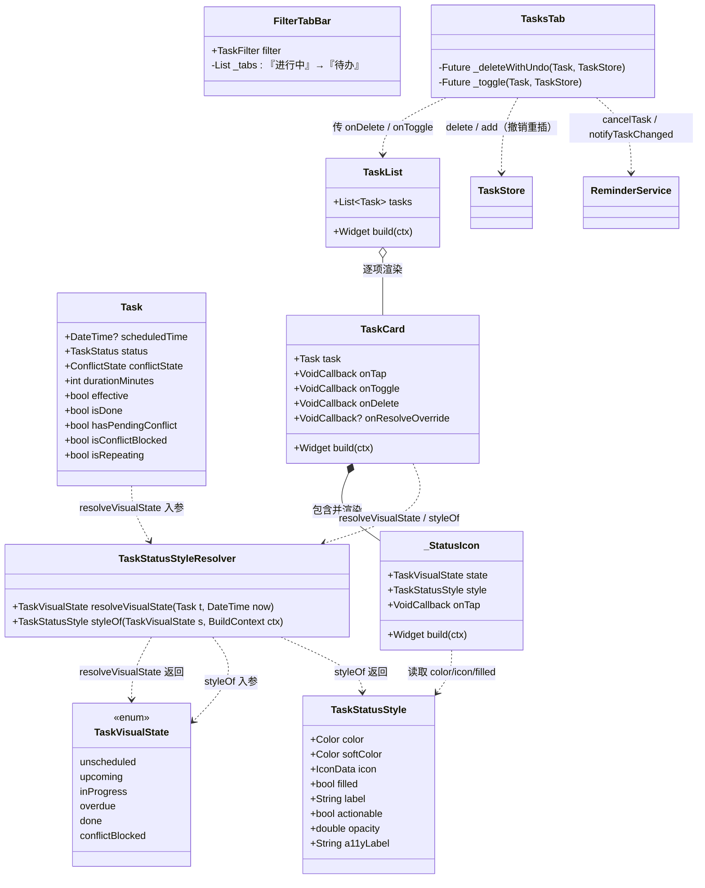
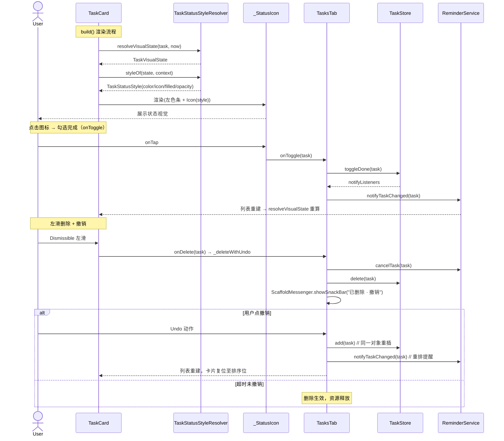
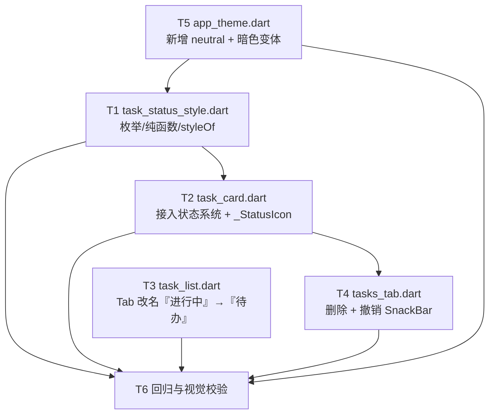

# 任务列表 · 视觉状态设计系统 — 架构设计 + 任务分解

> 项目：`daily_planner`（Flutter 3.44 日程/提醒 App，包名 `daily_planner`）
> 角色：架构师 高见远（Bob）
> 上游：产品经理《任务列表视觉状态设计规格》（`docs/task_visual_design_spec.md`）
> 范围：**仅架构设计 + 任务分解，不含实现代码**；代码由工程师后续完成。
> 约束：仅 Material Icons（`Icons.*`）；严禁 `lucide_icons`；深浅模式均成立；对比度 ≥ WCAG AA；不修改 `lib/models/task.dart` 持久化模型；进行中/逾期为派生状态、不存库。

---

## Part A · 系统设计

### 1. 实现方案 + 框架选型

#### 1.1 总体判断

本轮是**纯前端视觉状态系统的增强**，不涉及后端或数据模型变更。核心是在现有 `TaskCard` / `TaskList` / `TasksTab` 之上，引入一层**集中的"状态 → 视觉"映射**，把散落在组件里的颜色字面量、简单的"圆圈勾选"统一替换为**派生视觉状态 + 形状/颜色双层编码图标 + 透明度/色条/徽章组合**，并补上**左滑删除的撤销**。

#### 1.2 框架与依赖选型

| 维度 | 选型 | 理由 |
|---|---|---|
| UI 框架 | 沿用 Flutter Material 3（`useMaterial3: true` 已在 `AppTheme` 开启） | 零新增；`Dismissible` / `ScaffoldMessenger` / `AnimatedContainer` 均为原生能力 |
| 状态管理 | 沿用 `provider`（ChangeNotifier） | `TaskStore` 已基于它；删除/撤销的列表状态由 `TasksTab` 的 `StatefulWidget` 持有 |
| 本地存储 | 沿用 `hive` / `hive_flutter` | 撤销 = `store.delete` 后 `store.add` 重插同一对象，无需新盒 |
| **新增依赖** | **无** | 撤销 SnackBar 用 `ScaffoldMessenger` 原生即可；不引入任何包 |

#### 1.3 核心设计决策（难点 → 方案）

1. **集中映射文件（解耦视觉规则与组件）**
   新增 `lib/theme/task_status_style.dart`，把"视觉状态 → 颜色 / 图标 / 标签 / 透明度 / 是否可执行"全部收敛于此。`TaskCard` 不再散落 `AppTheme.xxx` 字面量，只调用 `resolveVisualState()` + `styleOf()`。视觉规则的变更（如未来新增"已暂停"态）只需改这一个文件。

2. **零新增暖色、复用 token**
   `warn`（橙 `#C07A2E`）从"即将到来"**重定义为"进行中"**，与 `accent`（青绿·未来）、`danger`（红·逾期）形成 `teal → amber → red` 三档紧迫梯度。**全部复用现有 token，不新增任何暖色**。仅"待安排"新增 1 个中性灰 `neutral`（需稳定身份，非 `onSurface` 临时 alpha）。

3. **派生状态不存库**
   `inProgress` / `overdue` 由 `resolveVisualState(Task, DateTime.now())` 计算（`scheduledTime` + `durationMinutes` + `status`），**不新增持久化字段**，不影响 `effective` 与提醒调度。模型 `lib/models/task.dart` 保持原样（回归红线）。

4. **深浅模式在 `styleOf` 内分支**
   沿用项目"固定 Hex 双主题共用"模式；`styleOf(state, context)` 内部按 `Theme.of(ctx).brightness` 分支，暗色下文字/图标改用 `dangerDark / okDark / warnDark` 提对比，背景仍用 `*Soft`。`resolveVisualState` 与深浅无关，保持纯函数。

5. **删除 = 操作层，与状态层解耦**
   "已删除"不是视觉状态。左滑 `Dismissible` + 撤销 `SnackBar` 落在**持有列表状态与持久化的一方**——经 Read 确认即 `lib/modules/tasks/tasks_tab.dart` 的 `_TasksTabState`（其 `_delete()` 当前直接 `reminder.cancelTask` + `store.delete`，无撤销）。撤销 = 重新 `store.add(task)` + `reminder.notifyTaskChanged(task)` 重排提醒。

---

### 2. 文件清单（含动作）

| 动作 | 相对路径 | 要点 |
|---|---|---|
| **新增** | `lib/theme/task_status_style.dart` | `TaskVisualState` 枚举；纯函数 `resolveVisualState`；`TaskStatusStyle` 数据类；`styleOf(state, ctx)`；集中颜色/图标/标签映射表 |
| **修改** | `lib/widgets/task_card.dart` | ① `_statusColor` → `styleOf(resolveVisualState(...))`；② `_Checkbox` 替换为 `_StatusIcon`（状态图标 + 勾选）；③ 应用左色条 / 卡片透明度 / 状态徽章；④ `AnimatedContainer(200ms)` 保留 |
| **修改** | `lib/modules/tasks/task_list.dart` | `FilterTabBar._tabs` 文案 `'进行中' → '待办'`（行为不变，仍过滤非完成）；可选新增"逾期置顶"组（默认不做） |
| **修改** | `lib/modules/tasks/tasks_tab.dart` | `_delete` → `_deleteWithUndo`：删除后 `ScaffoldMessenger.showSnackBar("已删除 · 撤销")`；撤销时 `store.add` + `reminder.notifyTaskChanged` 复原 |
| **可能修改** | `lib/theme/app_theme.dart` | 新增 `neutral`（浅 `#8A938F` / 深 `#9AA39F`）；新增暗色变体 `dangerDark=#E0705F` / `okDark=#5FBE8C` / `warnDark=#E0A050`（仅暗色文字/图标用） |

> 不改动：`lib/models/task.dart`、`lib/services/*`、`lib/widgets/empty_state.dart`、`lib/widgets/fade_in.dart`。

---

### 3. 数据结构与接口（类图）



**关键接口签名（供工程对齐）**

```dart
// lib/theme/task_status_style.dart
enum TaskVisualState {
  unscheduled,    // 待安排
  upcoming,       // 待执行(未来)
  inProgress,     // 进行中（派生）
  overdue,        // 已过期(含 missed)
  done,           // 已完成
  conflictBlocked // 冲突待处理(未生效)
}

/// 纯函数：由现有字段 + now 解析视觉状态（优先级自上而下）
TaskVisualState resolveVisualState(Task t, DateTime now);

class TaskStatusStyle {
  final Color color;      // 主色（左色条 / 图标）
  final Color softColor;  // 软底（徽章背景）
  final IconData icon;    // 状态图标（Icons.*）
  final bool filled;      // 描边 vs 填充
  final String label;     // 徽章文案
  final bool actionable;  // 是否可执行
  final double opacity;   // 卡片透明度
  final String a11yLabel; // 无障碍标签
}

/// 按状态 + 主题取样式；深浅模式在此分支（暗色用 *Dark 变体）
TaskStatusStyle styleOf(TaskVisualState s, BuildContext ctx);

// lib/widgets/task_card.dart
class _StatusIcon extends StatelessWidget {
  final TaskVisualState state;
  final TaskStatusStyle style;
  final VoidCallback onTap; // 点击 = onToggle 完成
  // 渲染：Container(左色条) + Icon(style.icon, filled? filled : outline, style.color)
  //       非完成态可点；点击后状态转 done
}

// lib/modules/tasks/tasks_tab.dart
Future<void> _deleteWithUndo(Task task, TaskStore store); // 替代原 _delete
```

---

### 4. 程序调用流程（时序图）



---

### 5. 待明确事项（Anything UNCLEAR）

| # | 事项 | 当前建议 | 备注 |
|---|---|---|---|
| U1 | **"逾期置顶"组**是否做 | 默认**不做**（避免改动分组逻辑风险），作为可选优化 | 分组桶（上午/下午/晚上/待安排）保持不变 |
| U2 | **进行中 pulse 动效**是否做 | 默认**不做**（非霓虹轻量可选） | 如做，仅极轻 opacity 脉动，沿用 `AnimatedContainer` |
| U3 | **临近提醒（<15min 到 start）warn 小圆点**是否做 | 默认**不做** | 属 spec F-8 可选增强 |
| U4 | `neutral` / 暗色变体放置位置 | 直接作为 `AppTheme` 静态常量新增（浅/深各一值） | 比"运行时 `onSurface` alpha"更稳、可读性更可控 |
| U5 | **撤销后是否滚动回原位置** | 不需 | `TasksTab._sortedFiltered` 按 `scheduledTime` 排序，重插后卡片自动回到正确排序位 |
| U6 | **SnackBar 时长** | 建议 6s（`Duration(seconds: 6)`） | 5–8s 区间内均可，由工程师定 |
| U7 | 撤销重排提醒的入口方法 | 用 `reminder.notifyTaskChanged(task)` | 已 Read `reminder_service.dart`：`notifyTaskChanged` 内部对非完成任务调用 `_scheduleTask`，语义吻合；非完成态不会误取消 |

> 已核实、非待明确项：`TaskStore.add()` 存在且可重插同一 `Task` 对象（`_box.put(task.id, task)`）；`ReminderService.notifyTaskChanged()` 为公开方法，撤销重排提醒可行。模型 `task.dart` 的 `isDone`/`hasPendingConflict`/`isConflictBlocked` getter 均已存在，派生状态无需改模型。

---

## Part B · 任务分解

### 6. 依赖包列表

> **本特性不引入任何新依赖。** 仅使用项目既有能力：

```
- flutter (SDK, Material 3)           # 原生：Dismissible / ScaffoldMessenger / AnimatedContainer / Icons.*
- provider ^x                         # 既有状态管理（TaskStore 为 ChangeNotifier）
- hive / hive_flutter ^x             # 既有存储（store.delete / store.add 重插）
- intl ^x                            # 既有（task_card 的 DateFormat）
```

撤销 `SnackBar` 直接用 `ScaffoldMessenger.of(context).showSnackBar` + `SnackBarAction`，**无需**任何第三方库。

---

### 7. 任务列表（有序、含依赖）

> 说明：任务 ID 与产品经理/team-lead 既定编号对齐。**依赖修正**：T5（token 定义）在技术上是 T1（`styleOf` 引用这些 token）的前置；为编译通过，建议 **T5 与 T1 同批合入或 T5 先合**。下文据此标注，而非"T5 依赖 T1"。

| Task ID | 任务名称 | 源文件 | 依赖 | 优先级 |
|---|---|---|---|---|
| **T1** | 新增状态映射层 `task_status_style.dart` | `lib/theme/task_status_style.dart`（新增） | 无（但引用 T5 的 token，建议与 T5 同批） | P0 |
| **T2** | `task_card.dart` 接入状态系统（替换 `_Checkbox` 为 `_StatusIcon`） | `lib/widgets/task_card.dart`（修改） | T1 | P0 |
| **T3** | `task_list.dart` 筛选 Tab 改名「进行中」→「待办」（+ 可选逾期置顶） | `lib/modules/tasks/task_list.dart`（修改） | 无（独立） | P1 |
| **T4** | `tasks_tab.dart` 删除 + 撤销 SnackBar | `lib/modules/tasks/tasks_tab.dart`（修改） | T2（基于现有 `onDelete` 透传接口）；基本独立 | P0 |
| **T5** | `app_theme.dart` 新增 `neutral` + 暗色变体 token | `lib/theme/app_theme.dart`（可能修改） | 无（为 T1 提供 token，应早于 T1 合入） | P1 |
| **T6** | 回归与视觉校验 | 上述全部 | T1–T5 | P0 |

**各任务要点**

- **T1**：定义 `TaskVisualState` 枚举；实现 `resolveVisualState(Task, DateTime)` 纯函数（优先级 done > conflictBlocked > missed→overdue > unscheduled > 窗口判定）；定义 `TaskStatusStyle`；实现 `styleOf(state, ctx)`（按 brightness 分支，暗色用 `*Dark`）。集中颜色/图标映射表。
- **T2**：`TaskCard.build` 用 `_status = resolveVisualState(task, DateTime.now())` + `style = styleOf(_status, ctx)` 替换 `_statusColor`；新增 `_StatusIcon`（左色条 `style.color` + `Icon(style.icon, filled? filled:outline, style.color)` + `onTap→onToggle`）；应用卡片 `opacity` 与状态徽章（逾期/进行中/冲突）；保留 `AnimatedContainer(200ms)` 与冲突红边框 + "资源冲突·未生效"块。
- **T3**：`FilterTabBar._tabs` 第 2 项 `(TaskFilter.active, '进行中')` → `'待办'`（行为不变，仍过滤 `status != done`）；可选"逾期置顶"组默认关闭。
- **T4**：`TasksTab._delete` 改名/重构为 `_deleteWithUndo(task, store)`：`reminder.cancelTask` + `store.delete` 后 `ScaffoldMessenger.of(context).showSnackBar(SnackBar(action: SnackBarAction('撤销', () => _undo)))`；`_undo` 内 `await store.add(task); await widget.reminder.notifyTaskChanged(task)`。`onDelete` 透传链（`TasksTab → TaskList → TaskCard`）保持不变。
- **T5**：`AppTheme` 新增 `static const Color neutral`（浅 `#8A938F` / 深 `#9AA39F`，建议按 brightness 取用的两个常量或 getter）、`dangerDark=#E0705F` / `okDark=#5FBE8C` / `warnDark=#E0A050`。不动既有 token。
- **T6**：回归——冲突红边框 + "确认覆盖"块保留；分组桶不变；`onToggle`/`onDelete` 行为不变；深浅模式对比度 ≥ AA（正文/图标 4.5:1，大图形/边框 3:1）；图标限 `Icons.*`（严禁 `lucide_icons`）；进行中/逾期为派生、不存库。

---

### 8. 共享知识（跨文件约定）

- **集中映射**：所有"状态 → 颜色/图标/标签/透明度"映射**只**写在 `lib/theme/task_status_style.dart`；组件内禁止散落 `AppTheme.xxx` 字面量判定状态。
- **深浅模式**：统一在 `styleOf(state, context)` 内按 `Theme.of(ctx).brightness` 分支；`resolveVisualState` 与深浅无关、保持纯函数。
- **图标约束**：状态图标与删除图标**一律 `Icons.*`**；**严禁 `lucide_icons`**（Flutter 3.44 不兼容）。已核对存在：`schedule_outlined` / `outlined_flag` / `play_circle` / `event_busy` / `check_circle` / `warning_amber_rounded` / `delete_outline`。
- **动画**：状态切换沿用 `AnimatedContainer(duration: 200ms)`，不新增动画库。
- **冲突保护（回归红线）**：`conflictBlocked` 必须保留整卡 `danger` 0.55 alpha 边框 + `dangerSoft` "资源冲突 · 未生效"块 + "确认覆盖"按钮；标题转 `danger`。
- **删除是操作不是状态**：删除视觉语言固定 `danger`/`dangerSoft`（仅用于滑动背景提示）；`SnackBar` 主色用 `accent` + "撤销"文字按钮（**danger 不用于 SnackBar**，避免与"错误"语义混淆）；删除不进入颜色/图标状态体系。
- **可执行性约定**：`actionable` = 待安排/待执行/进行中/逾期（true）；`done`/`conflictBlocked` = false（降透明度 + 删除线/红边框 + 徽章）。
- **模型冻结**：`lib/models/task.dart` 不得修改；`inProgress`/`overdue` 为派生，不改变 `effective` 与提醒调度。

---

### 9. 任务依赖图（Mermaid）



> 注：T3 与 T1/T2/T4/T5 均无依赖，可并行；T5 与 T1 建议同批（token 定义先行）。最终均需经 T6 回归。
