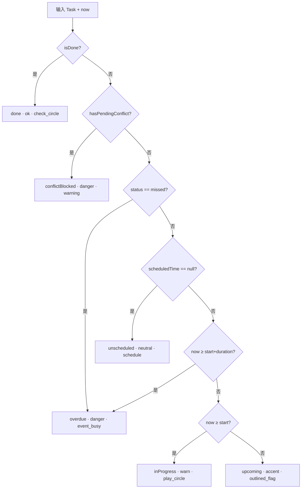
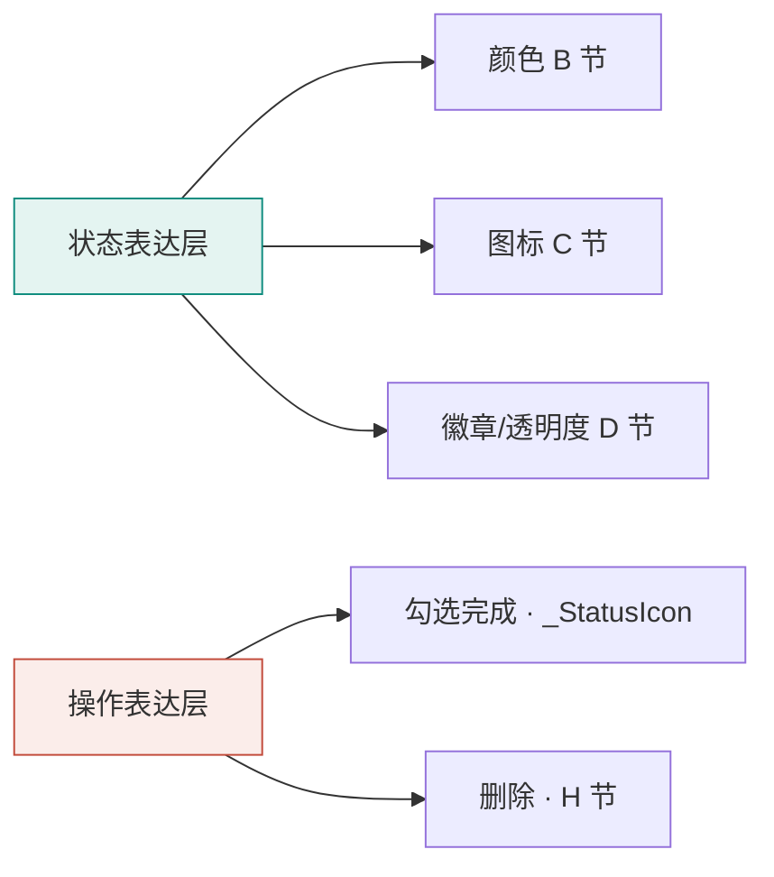

# 任务列表 · 视觉状态设计规格（Task Visual State Design Spec）

> 项目：`daily_planner`（Flutter 3.44 日程/提醒 App）
> 角色：产品经理（视觉状态系统设计）
> 范围：**仅设计与规格**，不含实现代码；交付"实现就绪"的改动方案与组件接口草图。
> 约束：仅使用 Flutter Material Icons（`Icons.*`）；沿用 `app_theme` 去饱和极简生产率视觉语言；深浅模式均成立。

---

## 0. 设计依据（已核对源码）

| 文件 | 关键事实 |
|---|---|
| `lib/models/task.dart` | `TaskStatus{pending,done,missed}`；`ConflictState{none,pendingConflict,confirmedOverride}`；`scheduledTime`(可 null)；`effective`(bool)；`durationMinutes`(默认 60)；派生 getter `isDone` / `hasPendingConflict` / `isConflictBlocked` / `isRepeating` |
| `lib/widgets/task_card.dart` | `_statusColor`：done→ok；missed→danger；`scheduledTime<now && !done`→warn；其余→primary。`_Checkbox` = 圆形 + 完成白色 check（即待替换的"简单圆圈图标"）。冲突：整卡 danger 红边框 + 红色"资源冲突·未生效"块 + "确认覆盖"按钮；标题变红 |
| `lib/modules/tasks/task_list.dart` | 分组桶：上午/下午/晚上/待安排；筛选 Tab：全部 / 进行中 / 冲突（`active` 计数 = 非完成，与"进行中"字样存在歧义） |
| `lib/theme/app_theme.dart` | accent `#0F8C7E` / accentStrong `#0A6E63` / accentSoft `#E4F4F1`；danger `#C24A3A` / dangerSoft `#FBEDEA`；warn `#C07A2E` / warnSoft `#FBF1E4`；ok `#3A9D6B` / okSoft `#E6F4EC`；圆角 10/14/20；8px 间距；`ColorScheme.fromSeed` 深浅双主题 |

**核心结论**：现有模型**没有**"进行中"独立字段；逾期判定目前仅靠 `scheduledTime<now`（未用 duration）。本方案引入**派生视觉状态**补齐。

---

## A. 状态定义表

> 6 个视觉状态，覆盖需求要求：待安排 / 待执行(未来) / 进行中 / 已过期(逾期) / 已完成 / 冲突待处理(未生效)。
> 「派生状态」= 由现有字段 + 当前时间 `now` 计算得出，不新增持久化字段。
> ⚠️ **"已删除"不是视觉状态**：删除是破坏性操作（见 H 节「操作层设计」），将任务从列表移除，不进入本表的颜色 / 图标状态体系。

| # | 视觉状态 | 一句话语义 | 触发条件（Dart 表达式，基于现有字段） | 类别 |
|---|---|---|---|---|
| 1 | **待安排** `unscheduled` | 尚未排定时间，将来需要安排执行 | `task.scheduledTime == null` | 派生 |
| 2 | **待执行** `upcoming` | 已排定，触发时间在未来 | `scheduledTime != null && now.isBefore(scheduledTime)` | 派生 |
| 3 | **进行中** `inProgress` | 已进入执行时段（当前时刻落在 `[start, start+duration)` 窗口内） | `scheduledTime != null && !now.isBefore(scheduledTime) && now.isBefore(start.add(duration))` | **派生（重点①）** |
| 4 | **已过期/逾期** `overdue` | 执行时段已结束仍未完成（含一次性"已错过"） | `now.isAfter(start.add(duration))` **或** `task.status == TaskStatus.missed` | **派生（重点②）** |
| 5 | **已完成** `done` | 用户已勾选完成 | `task.status == TaskStatus.done`（= `task.isDone`） | 持久字段 |
| 6 | **冲突待处理(未生效)** `conflictBlocked` | 资源冲突、默认不生效，等待用户确认覆盖 | `task.conflictState == ConflictState.pendingConflict`（= `task.hasPendingConflict`） | 持久字段 |

### 重点① "进行中"判定方案（无独立 status 字段）

现有 `TaskStatus` 只有 `pending/done/missed`，**没有"进行中"**。本方案定义为派生状态：

```
进行中 ⇔ scheduledTime 非空
      且 now ≥ scheduledTime
      且 now < scheduledTime + Duration(minutes: durationMinutes)
```

- **与"待执行"的边界**：`now < scheduledTime` → 待执行（未来）；`now ≥ scheduledTime` → 进入窗口，即进行中。
- **与"已过期"的边界**：窗口以 `scheduledTime + durationMinutes` 为结束；`now ≥ 结束点 && !done` → 已过期。
- `durationMinutes` 默认 60，故一次性短时任务窗口较窄；时长越长，"进行中"持续越久。
- **重复任务**：以"当日该次触发"计算窗口（daily/weekly 等取今天对应时刻），逻辑一致。
- 标注：这是**纯展示派生状态**，不影响 `effective` 与提醒调度（调度仍按 `scheduledTime`）。

### 重点② 逾期红色决策（需求1："超过截止时间未完成=红色"）

现状：`warn`(橙) 用于 `scheduledTime<now`（已开始）；`missed`(红) 用于"已错过"。两色并存。

**本方案决策：将"逾期未完成"升级为红色 `danger`，并与 `missed` 合并为同一视觉处理。**

- 理由：
  1. 用户需求 1 明确要求"超过截止时间未完成 → 红色高亮"，`danger` 是最强语义红，直接满足。
  2. `missed`（一次性到点未处理）与"时段结束仍未完成"本质都是"该做没做"，视觉合并为红降低认知负担。
  3. 保留 `missed` 作为**数据字段**（无障碍标签/后续统计可区分"一次性错过"与"重复逾期"），但渲染统一为红。
- 由此 `warn`(橙) 被**释放**，重新定义为"进行中/即将开始"的注意力色（见 B、C），形成 `teal(未来) → amber(进行中) → red(逾期)` 三档紧迫梯度，**全部复用现有 token，零新增暖色**。

---

## B. 完整颜色体系

> 原则：复用 `app_theme` 现有语义 token；仅"待安排"建议新增 1 个中性 token（`neutral`），因它需稳定身份且需深浅可读。

| 视觉状态 | 主色 token | Hex（浅/深） | 映射关系 / 说明 |
|---|---|---|---|
| 待安排 | **`neutral`**（新增） | 浅 `#8A938F` / 深 `#9AA39F` | 去饱和灰；亦可用 `scheme.onSurface.withAlpha(100)` 兜底。需稳定身份故新增 |
| 待执行(未来) | `accent` | `#0F8C7E` | 直接复用强调色（青绿），表达"已承诺的未来" |
| 进行中 | `warn` | `#C07A2E` | **重新定义** warn：原"即将到来/时间重叠"→ 扩展为"进行中"；amber 表达"此刻需注意" |
| 已过期(逾期) | `danger` | `#C24A3A` | 复用 danger；`missed` 同渲染为红 |
| 已完成 | `ok` | `#3A9D6B` | 直接复用 |
| 冲突待处理 | `danger` + 红边框 | `#C24A3A` | 复用 danger；额外整卡 `danger` 0.55 alpha 边框 + `dangerSoft` 冲突块 |

**软底色（用于徽章/底色块，沿用现有 `*Soft`）**：

| 状态 | 软底 token | Hex |
|---|---|---|
| 待安排 | `scheme.surface` / `neutral` α | — |
| 进行中 | `warnSoft` | `#FBF1E4` |
| 已过期 | `dangerSoft` | `#FBEDEA` |
| 已完成 | `okSoft` | `#E6F4EC` |
| 冲突 | `dangerSoft` | `#FBEDEA` |

**深浅模式可读性**：所有 token 为中明度去饱和色，固定 Hex 在深浅底上均可见（项目现行做法即固定 Hex 双主题共用）。**强化建议**（可选新增暗色变体，提升对比）：

- `dangerDark = #E0705F`、`okDark = #5FBE8C`、`warnDark = #E0A050`（仅暗色模式下用于**文字/图标**，背景仍用 `*Soft`）。
- 对比度目标：**正文/图标 ≥ WCAG AA 4.5:1；大图形/边框 ≥ 3:1**。红色文字在暗底（`#161A19`）上建议用 `dangerDark` 以满足 4.5:1。

---

## C. 状态图标方案（Material Icons 仅）

> 采用 **「形状 + 颜色」双层编码**（色盲友好）：6 个状态选用**不同剪影**的图标，即使失色也能凭形状分辨。
> 风格规则：**未完成 = outline（描边）**；**完成/强提醒 = filled（填充）** 以加强视觉权重。

| 视觉状态 | 图标（`Icons.*`） | 描边/填充 | 颜色 | 形状语义 |
|---|---|---|---|---|
| 待安排 | `Icons.schedule_outlined` | outline | neutral | 时钟空心 = 时间待定 |
| 待执行 | `Icons.outlined_flag` | outline | accent | 旗帜 = 已排定待发 |
| 进行中 | `Icons.play_circle` | **filled** | warn | 播放 = 正在执行 |
| 已过期 | `Icons.event_busy` | **filled** | danger | 日历带✕ = 时段错过 |
| 已完成 | `Icons.check_circle` | **filled** | ok | 对勾圆 = 已完成（通用认知） |
| 冲突待处理 | `Icons.warning_amber_rounded` | **filled** | danger | 警示 = 冲突未生效（与现有冲突块一致） |

**为何优于纯圆圈**：原 `_Checkbox` 是"圆 + 完成白勾"，未完成时是一个无信息的中性圆，无法传达"待安排/进行中/逾期"差异。新方案每个状态有**独立剪影**（时钟/旗帜/播放/日历✕/对勾/警示），配合颜色形成双重编码，扫一眼即可区分，且色盲用户可凭形状辨识。

**可替换备选**（如坚持"零圆形"）：`done` 可用 `Icons.task_alt`（方块对勾）替代 `check_circle`；`upcoming` 可用 `Icons.radio_button_unchecked` 但会回到圆形，故不推荐。

**交互约束**：该图标同时是**勾选控件**（点击 → `onToggle` 切换完成）。非完成态显示状态图标且可点；点击后过渡到 `done`（`check_circle`）。

---

## D. 「可执行 vs 不可执行」视觉区分

### 分类

| 类别 | 包含状态 | 含义 |
|---|---|---|
| **可执行 / Actionable**（未来需执行） | 待安排、待执行、进行中、已过期(逾期) | 仍需用户处理（逾期属"待补做"，仍 actionable） |
| **不可执行 / Non-actionable**（不需执行） | 已完成、冲突待处理(未生效) | done 已终结；conflictBlocked 未生效，须先"确认覆盖"才转 actionable |

> ⚠️ **"已删除"不参与可执行性分类**：删除是操作层行为（见 H 节），将任务移出列表，不属于 actionable / non-actionable 任一档，也不占用任何颜色 / 图标。

### 视觉权重矩阵（组合手段：透明度 / 图标描边填充 / 左侧色条 / 状态徽章）

| 手段 | 待安排 | 待执行 | 进行中 | 已过期 | 已完成 | 冲突待处理 |
|---|---|---|---|---|---|---|
| **左侧色条** | gray(neutral) | teal(accent) | amber(warn) | red(danger) | green(ok) | red(danger, 整卡边框) |
| **图标** | outline | outline | **filled** | **filled** | **filled** | **filled** |
| **卡片透明度** | 0.85 | 1.0 | 1.0 | 1.0 | **0.55** | **0.6** |
| **标题样式** | 正常 | 正常 | 正常/略粗 | 正常 | **删除线** | 红/正常 |
| **状态徽章** | "待安排" | — | "进行中" | "逾期" | — | **"未生效"**(红块) |
| **边框** | 发丝灰 | 发丝灰 | 发丝灰 | 发丝灰 | 发丝灰 | **red 0.55** |

**层级（视觉权重由高→低）**：
`逾期(red·filled)` ＞ `进行中(amber·filled)` ＞ `待执行(teal·outline)` ≈ `待安排(gray·outline·微降透明度)` ＞ `冲突(red边框·dim·徽章)` ≈ `已完成(dim·删除线)`。

→ 需要"立刻处理"的逾期最跳；"正在做"次之；未来任务清晰可期；已完成/未生效自然退到背景，界面层级分明。

---

## E. 实现方式（实现就绪的设计，非代码）

### E.1 需新增 / 修改的文件

| 动作 | 文件 | 内容 |
|---|---|---|
| **新增** | `lib/theme/task_status_style.dart` | 集中"状态 → 颜色/图标/标签"映射；纯函数 `resolveVisualState` + `styleOf` |
| **修改** | `lib/widgets/task_card.dart` | ① `_statusColor` 改为调用新映射；② `_Checkbox` 替换为 `_StatusIcon`（渲染状态图标、保留 `onTap`）；③ 应用左色条 / 透明度 / 徽章 |
| **可能修改** | `lib/modules/tasks/task_list.dart` | 分组桶可选增加"逾期"置顶组；"进行中"筛选 Tab 语义澄清（见 F-6） |

### E.2 核心组件 / 函数接口草图（签名级，供开发对齐）

```dart
// lib/theme/task_status_style.dart
enum TaskVisualState {
  unscheduled,   // 待安排
  upcoming,      // 待执行(未来)
  inProgress,    // 进行中（派生）
  overdue,       // 已过期(逾期, 含 missed)
  done,          // 已完成
  conflictBlocked// 冲突待处理(未生效)
}

/// 纯函数：由现有字段 + now 解析视觉状态（优先级自上而下）
TaskVisualState resolveVisualState(Task t, DateTime now) {
  if (t.isDone) return TaskVisualState.done;
  if (t.hasPendingConflict) return TaskVisualState.conflictBlocked;
  if (t.status == TaskStatus.missed) return TaskVisualState.overdue; // 一次性错过=红
  if (t.scheduledTime == null) return TaskVisualState.unscheduled;
  final start = t.scheduledTime!;
  final end = start.add(Duration(minutes: t.durationMinutes));
  if (now.isAfter(end)) return TaskVisualState.overdue;
  if (!now.isBefore(start)) return TaskVisualState.inProgress;
  return TaskVisualState.upcoming;
}

class TaskStatusStyle {
  final Color color;        // 主色（左色条/图标）
  final Color softColor;    // 软底（徽章背景）
  final IconData icon;      // 状态图标
  final bool filled;        // 描边 vs 填充
  final String label;       // 无障碍/徽章文案
  final bool actionable;    // 是否可执行
  final double opacity;     // 卡片透明度
}

/// 按状态 + 主题取样式；深浅模式在此分支（暗色用 *Dark 变体提对比）
TaskStatusStyle styleOf(TaskVisualState s, BuildContext ctx);
```

```dart
// lib/widgets/task_card.dart（改造示意，非实现）
class _StatusIcon extends StatelessWidget {
  final TaskVisualState state;
  final TaskStatusStyle style;
  final VoidCallback onTap;  // 点击 = onToggle 完成
  // 渲染：Container(左色条) + Icon(style.icon, filled? filled : outline, style.color)
  //       非完成态可点；点击后状态转 done
}
```

### E.3 状态解析流程图（Mermaid）



### E.4 深浅模式 & 无障碍

- **深浅模式**：颜色固定 Hex 双主题共用（沿用项目模式）；暗色下文字/图标改用 `dangerDark/okDark/warnDark` 提对比；软底 `*Soft` 两模式通用。
- **对比度**：正文/图标 ≥ 4.5:1（AA），大图形/边框 ≥ 3:1；用 `contrast_tester` 或在线校验红/绿/橙在 `#161A19` 与 `#FCFDFC` 上的比值。
- **无障碍（a11y）**：每个状态图标配 `Semantics(label:)`（如 "已过期任务"）；图标+颜色双编码确保色盲可辨；`missed` 与 `overdue` 在无障碍标签上保留区分文案（"一次性已错过" vs "已逾期"）。
- **动效**：图标切换沿用现有 `AnimatedContainer(200ms)`；进行中可加极轻 pulse（非霓虹），可选。

---

## F. 待确认问题（需用户拍板）

| # | 决策点 | 我的推荐 | 备选 |
|---|---|---|---|
| 1 | 是否启用"进行中"派生状态（时间窗口） | **是**，默认开启 `now∈[start,start+dur)` | 否（维持仅 pending/done/missed 三态） |
| 2 | 逾期红是否合并 `missed` | **是**，二者统一渲染 `danger` 红；`missed` 仅留作数据/无障碍区分 | 否（missed 红、其他逾期橙，保留双色） |
| 3 | "进行中"配色 | **`warn` 橙**，形成 teal→amber→red 梯度（复用 token） | `accentStrong` 深青绿（非警示，但未来/进行中同色系区分弱） |
| 4 | 是否新增独立"已暂停/不生效"状态 | **暂不新增**；`conflictBlocked` 即代表"未生效" | 新增 `snoozed/inactive` 独立态 |
| 5 | 图标描边 vs 填充默认风格 | **未完成 outline、完成/强提醒 filled** | 全部 outline（更轻） |
| 6 | "进行中"筛选 Tab 语义 | 当前=非完成(active)，**建议改名为"待办"**；真"进行中"作为后续增强 | 直接让"进行中"Tab 过滤 `inProgress` |
| 7 | "待安排"是否算可执行 | **算**（未来需安排执行），仅微降透明度 0.85 | 算 non-actionable 并灰阶到底 |
| 8 | 临近提醒（<15min 到 start）是否用 `warn` 小圆点 | **是**，复用 warn 作软提示（可选） | 不加，warn 仅用于进行中 |

---

## G. 落地检查清单（供开发）

- [ ] 新增 `task_status_style.dart`：`TaskVisualState` / `resolveVisualState` / `TaskStatusStyle` / `styleOf`
- [ ] `task_card.dart`：`_statusColor` 替换为 `styleOf(resolveVisualState(...))`；`_Checkbox` → `_StatusIcon`
- [ ] 应用左色条 + 透明度 + 状态徽章（逾期/进行中/冲突/待安排）
- [ ] 暗色变体 `dangerDark/okDark/warnDark`（如采纳 E.4）
- [ ] 所有图标限 `Icons.*`（已核对均存在：schedule_outlined / outlined_flag / play_circle / event_busy / check_circle / warning_amber_rounded）
- [ ] 无障碍 `Semantics` 标签 + 对比度校验 ≥ AA
- [ ] 回归：冲突红边框 + "确认覆盖"块保持；分组桶（上午/下午/晚上/待安排）不受影响
- [ ] 删除操作层（触发方式 + 撤销 SnackBar）：详见 H 节「操作层设计（删除操作）」

---

## H. 操作层设计（删除操作）

### H.1 操作层与状态层分离

颜色体系（B 节）与状态图标（C 节）描述的是任务"**当前条件**"（待安排 / 待执行 / 进行中 / 已过期 / 已完成 / 冲突）；"**删除**"是破坏性操作（action），**不是状态**。

- **状态表达层**：用颜色 + 图标 + 徽章回答"这个任务现在是什么情况"。
- **操作表达层**：用交互控件（左滑 / 菜单 / 长按）回答"我可以对这个任务做什么"。
- **边界**：状态图标（C 节 `_StatusIcon`）**仅用于表达状态 + 勾选完成**，不得兼作删除控件，避免用户误将"状态图标"当作"删除"。删除走独立的操作入口（见 H.2）。



> ⚠️ **"已删除"不是任务视觉状态**：它是将任务从列表移除的操作结果，不进入 A 节颜色 / 图标状态体系，仅在操作层处理（见下）。

### H.2 删除操作可视化（三种触发方式对比 + 推荐）

**现状（已核对 `task_card.dart`）**：`TaskCard` 用 `Dismissible` 左滑删除（end-to-start），背景 `dangerSoft` 浅红底 + `Icons.delete_outline` 红图标，回调 `onDelete`；`task_list.dart` / `tasks_tab` 透传 `onDelete`。

| 方式 | 交互 | 显性度 | 误删风险 | 评价 |
|---|---|---|---|---|
| ① 左滑删除（沿用现状） | 卡片 end→start 滑动 | 中（手势隐含） | 中（滑错可能触发） | 顺手、零布局占位；与现状一致，迁移成本最低 |
| ② 右上角 overflow 菜单（⋮） | 点 `Icons.more_vert` → "删除" | 高（显性） | 低（需二次点选） | 最清晰可控；但每次删除多一步，列表略增图标 |
| ③ 长按菜单 | 长按 → 操作浮层 | 中 | 低 | 适合多操作聚合；但长按易与系统选择 / 拖拽冲突 |

**推荐：① 左滑删除（沿用现状）为主；可选叠加 ② 的 overflow 菜单（`Icons.more_vert`）作为显性兜底增强。**

- 理由：左滑手势在移动端"顺手"且零布局占位，与现有实现一致、成本最低；保留 `dangerSoft` 浅红背景 + `delete_outline` 红图标即可，删除视觉语言统一用 `danger` 语义（红 / `dangerSoft`）。
- **与状态色不冲突**：状态色（accent 青绿 / warn 橙 / ok 绿）描述"任务条件"，红色仅出现在"滑动删除"这一操作手势背景中，二者语义域不同，用户不会混淆"这个任务逾期了（红状态）"与"我正在滑删它（红背景）"。
- 若担心隐性导致新用户找不到删除，可在卡片右上角补 `Icons.more_vert`，菜单内含"删除"，作为显性兜底（推荐增强项，非必须）。

### H.3 防误删（推荐）

**删除后提供 SnackBar 撤销（"已删除 · 撤销"）**。

- 理由：删除是破坏性、一次性操作，任务（含资源 / 重复配置）误删后难以重建；撤销槽（5–8s）可低成本挽回，是 Material Design 删除交互的标准做法。
- 视觉：SnackBar 用 `accent` 主色 + "撤销"文字按钮（`danger` 红仅用于滑动背景提示，不用于 SnackBar，以免与"错误"语义混淆）。
- 实现层（供开发）：`onDelete` 触发后先 `setState` 移除并缓存任务对象，`ScaffoldMessenger.showSnackBar` 提供 `Undo` 动作；点撤销则回插原位置 / 恢复原记录。

### H.4 落地要点（与状态层边界）

- 删除 = 操作，**不新增任何视觉状态、颜色 token 或状态图标**。
- 删除入口独立于 `_StatusIcon`（状态 / 勾选控件），二者视觉与交互解耦。
- 删除视觉语言固定用 `danger` / `dangerSoft`，不与状态色混用；图标限 `Icons.*`（`delete_outline` / `more_vert` 均存在，严禁 lucide）。
- 所有改动收敛在 `task_card.dart`（Dismissible + SnackBar）与 `task_list.dart`（透传 `onDelete` / `onUndo`），不触碰状态映射层。
